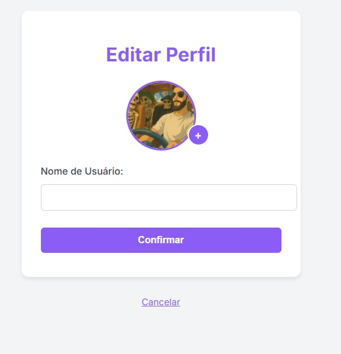

# Front-end Web

O **EasyBook** é uma plataforma de agendamento desenvolvida para profissionais do setor de beleza e autocuidado, como cabeleireiros e esteticistas. Esta etapa do projeto foca no desenvolvimento da **interface web**, proporcionando uma experiência visual clara, intuitiva e acessível aos usuários.

## Projeto da Interface Web

A interface Web permite que clientes realizem agendamentos de forma prática e rápida, ao mesmo tempo em que os profissionais podem visualizar e organizar seus horários com facilidade. O front-end é projetado com foco em usabilidade e integração fluida com a API da aplicação.

Com isso, o EasyBook melhora significativamente a experiência do usuário final, contribui para a fidelização dos clientes e auxilia no crescimento dos microempreendedores ao reduzir erros e conflitos na agenda.

Este projeto de front-end contempla o desenvolvimento completo da camada visual da aplicação, incluindo:

### Wireframes 

#### [Easybook no Figma](https://www.figma.com/design/juU3fxkgVJXXccndVplkDl/EasyBook--Copy-?node-id=2001-3&m=draw)

#### > *Wireframe da tela de login da aplicação.*
  

#### > *Wireframe da tela de cadastro da aplicação.*
 

#### > *Wireframe da tela inicial do profissional da aplicação.*
 

#### > *Wireframe da tela inicial do cliente da aplicação.*

#### > *Wireframe da tela de edição de agenda da aplicação.*
   

#### > *Wireframe da tela de editar perfil da aplicação.*
  

### Design Visual
O design da aplicação foi definido com os seguintes elementos visuais:

- **Paleta de cores:** Roxo `#8B5CF6` (primária), Branco `#F3F4F6`, Cinza `#6B7280`, Vermelho `#EF4444` e Verde `#10B981`
- **Tipografia:** Fonte principal: *Inter*, secundária: *Arial*.
- **Estilo:** Minimalista, com foco em clareza e hierarquia visual.

## Fluxo de Dados

### Cadastro de Usuário (Cliente ou Servidor)

- Frontend (HTML/JS):

Usuário preenche o formulário (nome, e-mail, senha etc.)

Ao clicar em Cadastrar-se, o frontend faz uma requisição POST /api/cadastro.

- Backend (ASP.NET Core):

Recebe os dados no endpoint.

Valida os campos.

Criptografa a senha.

Insere os dados no banco de dados.

Retorna resposta 201 Created ou 400 BadRequest se houver erro.
### Login do Usuário

- Frontend (HTML/JS):

Usuário insere e-mail e senha.

Ao clicar em Fazer Login, faz POST para /api/login.

- Backend:

Busca o usuário pelo e-mail.

Compara a senha fornecida com a senha criptografada no banco.

Se válido:

Gera um JWT token.

Retorna token e dados básicos (id, nome, tipo).

Se inválido:

Retorna 401 Unauthorized.
### Agendamento de Serviços
- Frontend:

Usuário logado acessa a tela de agendamento.

Escolhe serviço, data e horário.

Clica em Agendar → POST para /api/agendamentos com token JWT no header.

- Backend:

Valida o token JWT.

Verifica disponibilidade do serviço.

Se disponível, insere no banco.

Retorna 201 Created.
  
## Tecnologias Utilizadas
- Git e GitHub (controle de versão)
- Figma (para design e prototipagem)
- Radix (para paleta de cores)
- Visual Studio Code
- JavaScript, HTML, CSS

## Considerações de Segurança

[Discuta as considerações de segurança relevantes para a aplicação distribuída, como autenticação, autorização, proteção contra ataques, etc.]

## Implantação

[Instruções para implantar a aplicação distribuída em um ambiente de produção.]

1. Defina os requisitos de hardware e software necessários para implantar a aplicação em um ambiente de produção.
2. Escolha uma plataforma de hospedagem adequada, como um provedor de nuvem ou um servidor dedicado.
3. Configure o ambiente de implantação, incluindo a instalação de dependências e configuração de variáveis de ambiente.
4. Faça o deploy da aplicação no ambiente escolhido, seguindo as instruções específicas da plataforma de hospedagem.
5. Realize testes para garantir que a aplicação esteja funcionando corretamente no ambiente de produção.

## Testes

[Descreva a estratégia de teste, incluindo os tipos de teste a serem realizados (unitários, integração, carga, etc.) e as ferramentas a serem utilizadas.]

1. Crie casos de teste para cobrir todos os requisitos funcionais e não funcionais da aplicação.
2. Implemente testes unitários para testar unidades individuais de código, como funções e classes.
3. Realize testes de integração para verificar a interação correta entre os componentes da aplicação.
4. Execute testes de carga para avaliar o desempenho da aplicação sob carga significativa.
5. Utilize ferramentas de teste adequadas, como frameworks de teste e ferramentas de automação de teste, para agilizar o processo de teste.

# Referências

- [Figma – Documentação oficial](https://help.figma.com/)
- [Radix – Documentação](https://www.radix-ui.com/blog/themes-3)

